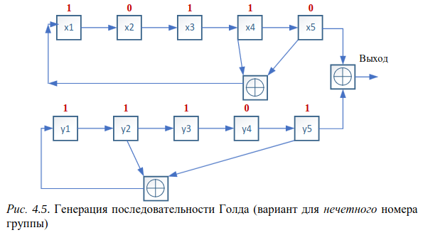
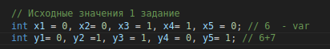
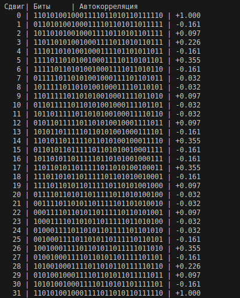
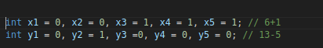
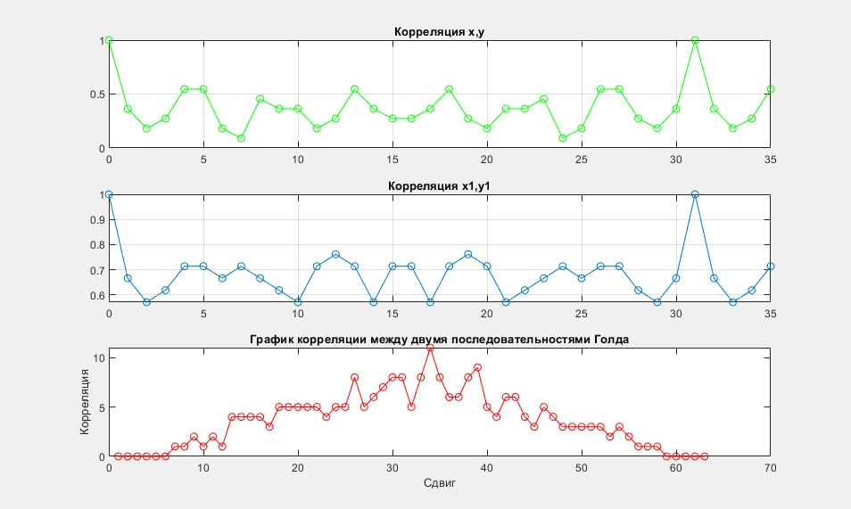

# Занятие №4. 
# Изучение корреляционных свойств последовательностей, используемых для синхронизации в сетях мобильной связи

1) Напишите программу на языке С/С++ для генерации
последовательности Голда, используя схему:

- порождающие полиномы x и y :

2) Сделайте поэлементный циклический сдвиг последовательности и посчитайте автокорреляцию исходной последовательности и 
сдвинутой. Сформируйте таблицу с битовыми значениями 
последовательностей, в последнем столбце которой будет 
вычисленное значение автокорреляции.

Полученная таблица

3) Сформируйте еще одну последовательность Голда, используя 
схему из 1 пункта, такую что x=x+1, а y= у-5

- функция автокорреляции в зависимости от величины задержки

для исходной последовательности и измененной последовательности; для двух последовательностей

