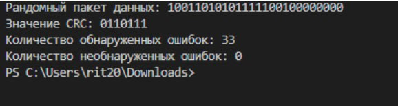
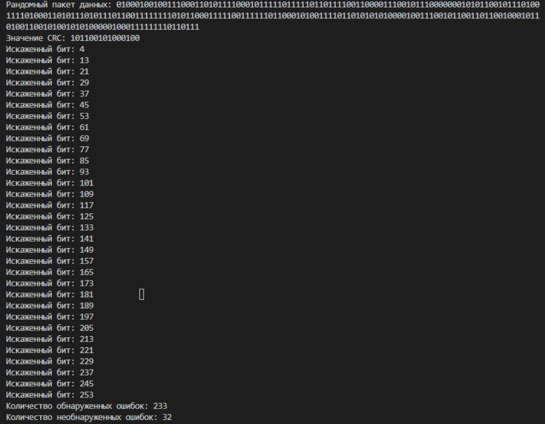

# Занятие №5. Циклический избыточный код. CRC

## 1 Задание

- Сформировали массив длиною 16;

- Делили исходные данные на полином G;

- Остаток от деления приписывается в конец массива исходных данных вместо нулей;

## 2 Задание

- В цикле длиной N+CRC-1 на каждой итерации заменяется последовательно по одному биту у массива на прием. Стоит счетчик сколько раз приемник обнаружит ошибку.

